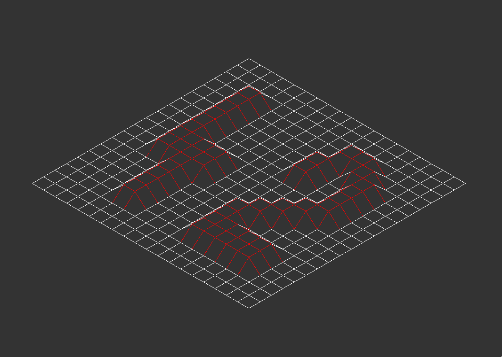
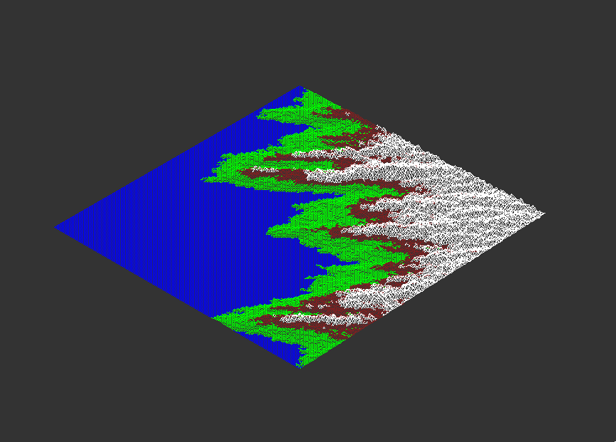
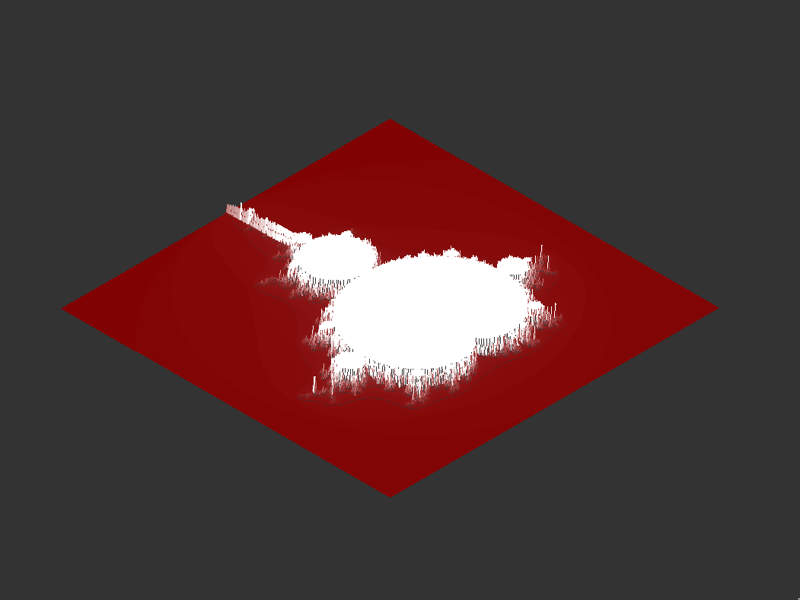
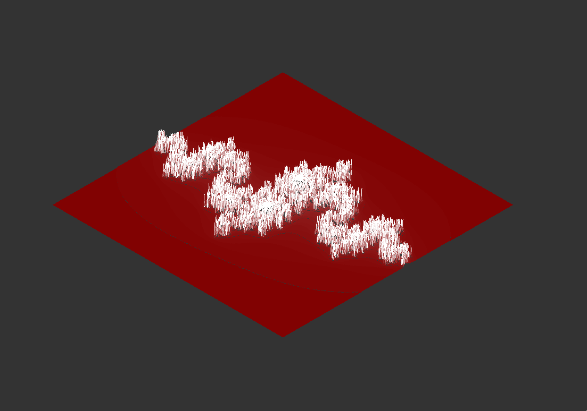

#  Fdf
This 42 proyect have the purpose of teaching basic graphic programming in C with the MinilibX library.

The goal of FdF is to create a C program capable of reading .fdf files, which contain x, y, z coordinates corresponding to a map that must be rendered graphically.

These files may also include color codes linked to the coordinates, which must also be interpreted.

**File example**
```
0  0  0  0  0  0  0  0  0  0
0 10 10 10 10 10 10 10 10  0
0 10 20,0xFF0000 15,0xFF0000 12 15,0xFF0000 17,0xFF0000 20,0xFF0000 10  0
0 10 15,0xFF0000 10 12 15,0xFF0000 15,0xFF0000 15,0xFF0000 10  0
0  5 15,0xFF0000 10 12 15,0xFF0000 15,0xFF0000 13 10  0
0  5 10  5  7 12 12 12 10  0
0  5  7  1  2  7  5  5  7  0
0  3  0  0  1  2  2  2  5  0
0  1  0  0  0  0  0  0  3  0
0  0  0  0  0  0  0  0  0  0
```

The map should be displayed using an isometric projection, a method for visualizing 3D graphics with a 2D library like MiniLibX.

**Examples of generated maps**





